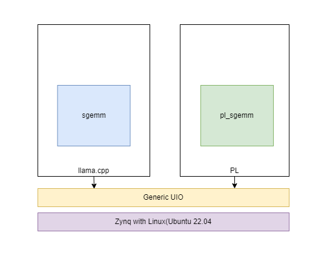

# ZynqMP llama.cpp

[](https://opensource.org/licenses/MIT)

# Project Overview
<div style="text-align: center;">
    
</div>
This project aims to attempt the porting of Llama on the Zynq/MP platform, primarily using the HLS (High-Level Synthesis) approach. The basic architecture diagram is as follows:

## Supported Features:
- Support for q4 mode only
- Single-thread mode only

## Usage Instructions
1. Use Vitis 2023.2 to compile the `hw/blas` project and export the HLS IP.
2. Use Vivado 2023.2 to compile the `hw/project` project.
3. Copy `llama.cpp` to the Ubuntu system on the KR26 development board and use the following commands:
   ```sh
   make llama-cli -j $(nproc)
   cd firmware
   ./load.sh
   cd ..
   sudo ./llama-cli -m some_q4.gguf -t 1
